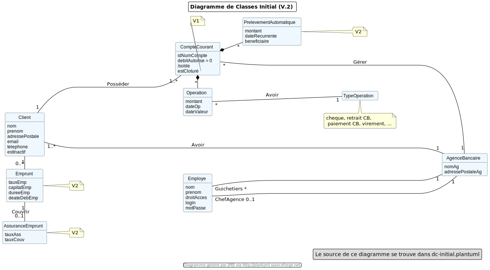

= DailyBank Documentation Technique

La documentation technique de DailyBank est destinée aux programmeurs en charge de la maintenance de l'application. Elle décrit toutes les fonctionnalités développées dans une version donnée et contient tous les éléments essentiels à connaître pour comprendre le code écrit.

== Sommaire

- Présentation rapide de l'application
- Use Case
- Diagramme de classes
- Architecture
- Fonctionnalités

== Présentation rapide de l'application

Introduction :
DailyBank est une application bancaire complète qui permet aux utilisateurs de gérer leurs comptes bancaires et d'effectuer diverses opérations financières. Elle offre un ensemble de fonctionnalités adaptées aux différents rôles des utilisateurs, tels que les clients, les chefs d'agence et les guichetiers.

Gestion des clients :
DailyBank permet aux utilisateurs d'accéder à leurs comptes bancaires personnels et de consulter les informations relatives à leurs soldes, à l'historique des transactions et aux relevés. Ils peuvent également effectuer des transactions, y compris des virements entre leurs propres comptes ou vers des tiers.

Supervision et gestion des opérations :
Les chefs d'agence utilisent l'application pour superviser et gérer les activités au sein de leur agence. Ils ont accès à des fonctionnalités telles que la gestion des employés, la gestion des clients, la génération de rapports financiers et l'approbation des transactions.

Interactions avec les clients :
Les guichetiers, en tant qu'employés de la banque, utilisent l'application pour interagir directement avec les clients. Ils peuvent gérer les comptes clients, traiter les transactions, tels que les dépôts, les retraits et les virements, et clôturer les comptes sur demande. Ils assurent un service clientèle de qualité en respectant les politiques et les procédures bancaires.

Infrastructure technique :
Sur le plan technique, DailyBank utilise une base de données Oracle SQL pour stocker les informations des utilisateurs, telles que les détails des comptes, les transactions et les informations des clients. L'application est développée en utilisant JavaFX, une plateforme qui offre une interface utilisateur conviviale et réactive.

== Use Case

image::Images/uc-initialv2.svg[]

Dans ce diagramme des cas d'utilisation (Use case), nous trouvons donc 2 rôles principaux : Les chefs d'agences et les guichetiers, dont le première est le supérieur hiérarchique de l'autre. Les guichetiers peuvent faire les opérations simples sur un clients (création, modification), mais également sur les comptes clients (virement, crédit, création, cloture)
Dans la dernière version de l'application, il peut également generer un revenu mensuel en PDF ainsi que gèrer les prélevements automatiques (CRUD : create read update delete)

Le chef d'agence quand à lui a une plus grande responsabilités au niveau de la gestion en elle même de l'application, ce qui suit le fait qu'il soit également plus important dans la gestion de l'entreprise. Au niveau des fonctionalités, il peut donc gèrer les employés (CRUD), rendre un client inactif, faire un débit exceptionnel et enfin simuler un emprunt et une assurance d'emprunt

== Diagramme de classes

Le diagramme de classe nous explique le fonctionnement de l'application au niveau de la base de données qui gère celle ci. On à tout d'abord les clients, qui sont stockés avec différentes informations classiques comme le nom, le prénom, le mail, ect mais également l'activité (si actif ou non). Un client peut possèder un ou plusieurs comptes bancaires, avec un ID, un solde, un découvert autorisé, et un état d'ouverture (clotûrer ou non)
Tout ceci fait partie d'une agence bancaire qui sert donc de structure d'échange et de gestion des clients et des comptes, mais qui contient également des employés qui travaillent dans celle ci. On différenciera les guichetiers qui ont une partie gestion des clients et des comptes clients et qui sont plusieurs, au chef d'Agence qui s'occupe de la gestion des employés et qui est seul dans une agence.

Un compte courant peut subir une opération, d'un certaint montant, à une certaines dates et surtout d'un certains type (débit, crédit, ect).Il peut également subir un prélevement automatique depuis la deuxième version, qui est défini comme un débit qui s'effectue avec une périodicité régulière, et un montant identique à chaque fois.

Les clients peuvent réaliser des emprunts qui sont couverts par une assurance d'emprunt, avec un taux, une durée, un capital et une date de début.
Ils peuvent également mis être inactif, et dans ce cas il n'est plus possible de créer un compte, réaliser un emprunt, sur ce même client
Un compte peut également être clotûrer mais pas supprimé pour des raisons légales. Il sera donc uniquement en consultation, mais nullement utilisable.

== Architecture

L'architecture de DailyBank se compose de plusieurs sous-systèmes qui interagissent entre eux pour fournir une solution complète. Les sous-systèmes sont les suivants :

Poste client : il s'agit de l'interface utilisateur de l'application. Il permet à l'utilisateur de communiquer avec le système, de visualiser les informations et de saisir des données.
Serveurs : il y a plusieurs serveurs dans le système, chacun avec un rôle spécifique. Les serveurs peuvent être physiques ou virtuels, et peuvent être répartis sur plusieurs machines. Les serveurs sont les suivants :
Serveur d'application : il s'agit du serveur qui exécute le code de l'application. Il peut être configuré pour fournir des services web ou d'autres types de services.
Serveur de base de données : il s'agit du serveur qui stocke les données de l'application. Il peut être utilisé pour stocker des données relationnelles, NoSQL ou d'autres types de données.
Le système peut dépendre de plusieurs ressources externes pour fonctionner correctement. Les ressources externes peuvent être des bibliothèques, des frameworks ou d'autres types de logiciels. Les ressources externes utilisées dans le système sont les suivantes :

Framework de développement : le système est développé en utilisant un framework spécifique. Le framework fournit des fonctionnalités de base pour le développement d'applications web, telles que la gestion des sessions utilisateur, la gestion des connexions de base de données et la gestion des formulaires.
Bibliothèque de connexion de base de données : le système utilise une bibliothèque spécifique pour se connecter à la base de données. La bibliothèque fournit des méthodes pour exécuter des requêtes SQL et pour récupérer les résultats.
L'application est structurée en packages selon les principes suivants :

Package de contrôleurs : ce package contient les classes qui contrôlent le flux d'exécution de l'application. Les contrôleurs sont responsables de récupérer les données saisies par l'utilisateur, de les traiter et de les stocker dans la base de données.
Package de modèles : ce package contient les classes qui représentent les données de l'application. Les modèles sont responsables de la validation des données saisies par l'utilisateur et de la communication avec la base de données.
Package de vues : ce package contient les classes qui définissent l'interface utilisateur de l'application. Les vues sont responsables de l'affichage des données de l'application et de la récupération des données saisies par l'utilisateur.
En plus de cela, le projet suit le modèle MVC (Modèle-Vue-Contrôleur), où les classes sont séparées en trois catégories selon leur rôle :

Le modèle représente les données de l'application, et est stocké dans une base de données. Les classes correspondantes sont regroupées dans le package "models".
La vue correspond à l'interface utilisateur, et est gérée par les classes du package "views". Chaque fenêtre est représentée par une classe distincte.
Le contrôleur est responsable de la coordination entre le modèle et la vue, et gère les actions de l'utilisateur. Les classes correspondantes sont regroupées dans le package "controllers". Il y a un contrôleur pour chaque fonctionnalité du logiciel, comme l'édition de clients, la fenêtre de connexion, etc.

== Fonctionalités

=== -1. Créditer/débiter un compte (Java et BD avec procédure stockée) VIGNOLLES Loris / BENGHOUZI Pauline

Explication : Cette fonctionnalité permet à un guichetier de créditer ou de débiter un compte bancaire d'un montant spécifique. La base de données doit être mise à jour avec la nouvelle valeur du solde du compte. L'opération doit être effectuée à l'aide d'une procédure stockée en Java.

Partie de use case réalisé : Cas d'utilisation "Gérer les comptes bancaires"

Scénarios éventuels :

Le guichetier n'a pas les autorisations nécessaires pour effectuer l'opération.
Le compte bancaire n'existe pas ou est fermé.
Le montant à créditer/débiter est supérieur au solde disponible.

Partie du diagramme de classes données nécessaires : Lecture et mise à jour du solde du compte bancaire.

Classes : classe de gestion des données (model.orm.AccesBD_Operation),  une classe de contrôleur de dialogue (application.control.OperationsManagementController,CompteEditorPaneManagementController), classe de vue (application.view.OperationsManagement,CompteEditorPaneManagement).

Éléments essentiels à connaître :

Les procédures stockées en Java.
La gestion des erreurs en cas de montant supérieur au solde disponible.

=== -2. Créer un compte JOURDAN Yann

Explication : Cette fonctionnalité permet à un guichetier de créer un nouveau compte bancaire pour un client. Le compte doit être associé à un client existant et avoir un solde initial de 0€.

Partie de use case réalisé : Cas d'utilisation "Gérer les comptes bancaires"

Scénarios éventuels :

Le guichetier n'a pas les autorisations nécessaires pour effectuer l'opération.
Le client associé au compte n'existe pas.

Partie du diagramme de classes données nécessaires :

Lecture et mise à jour de la liste des clients et des comptes bancaires.

Éléments essentiels à connaître :

La gestion des erreurs en cas de client inexistant.
La gestion des clés étrangères pour associer le compte au client.

Classes : classe de gestion des données (model.orm.AccesCompteCourant),  une classe de contrôleur de dialogue (application.control.ComptesManagementController), classe de vue (application.view.CompteManagement).

=== -3. Effectuer un virement de compte à compte : VIGNOLLES Loris 

Explication : Le guichetier est en mesure de transférer de l'argent d'un compte bancaire à un autre compte bancaire appartenant au même client ou à un autre client.

Partie de use case réalisé : Cette fonctionnalité est couverte par le cas d'utilisation "Effectuer un transfert".

Scénarios éventuels : L'utilisateur doit spécifier le compte source, le compte destination, le montant et la date de transfert. Si le compte source ne dispose pas de fonds suffisants, le transfert doit être refusé. Une fois le transfert effectué, le système doit générer un reçu pour le client.

Partie du diagramme de classes données nécessaires : En lecture, le guichetier doit accéder aux informations des comptes source et destination pour s'assurer que le transfert est valide. En mise à jour, le guichetier doit mettre à jour les soldes des comptes source et destination.

Éléments essentiels à connaître : Le guichetier doit être formé aux politiques de transfert de la banque, notamment les limites de transfert, les frais de transfert et les restrictions de pays. De plus, la sécurité doit être prise en compte, en assurant que seuls les guichetiers autorisés peuvent effectuer des transferts et que les transferts sont effectués sur des comptes vérifiés.

Classes : classe de gestion des données (model.orm.AccesCompteCourant),  une classe de contrôleur de dialogue (application.control.ComptesManagementController), classe de vue (application.view.CompteManagement).
Classes : classe de gestion des données (model.orm.AccesBD_Operation),  une classe de contrôleur de dialogue (application.control.OperationsManagementController,CompteEditorPaneManagementController), classe de vue (application.view.OperationsManagement,CompteEditorPaneManagement).

=== -4. Clôturer un compte : CARLIER Flavie	VIGNOLLES Loris

Explication : Le guichetier doit être en mesure de clôturer un compte sur demande du client ou s'il constate que le compte ne répond plus aux exigences de la banque (compte inactif, compte frauduleux, etc.).

Partie de use case réalisé - scénarios éventuels :

Acteur : Guichetier
Description : Clôture d'un compte
Pré-conditions : Le guichetier doit avoir l'autorisation de clôturer un compte et le client doit avoir les documents nécessaires pour cette opération.
Scénarios :
Le guichetier identifie le compte à clôturer.
Il vérifie que le compte est éligible à la clôture.
Il demande au client les documents nécessaires pour la clôture.
Il saisit les informations nécessaires dans le système.
Il confirme la clôture du compte.
Il remet au client les documents nécessaires.
Partie du diagramme de classes données nécessaires : en lecture, en mise à jour :

En lecture : le guichetier doit pouvoir lire les informations liées au compte à clôturer, telles que le solde du compte et les opérations effectuées.
En mise à jour : le guichetier doit être en mesure de clôturer le compte dans le système.

Éléments essentiels à connaître :

Gestion d'un compte clôtrer
Condition pour clôturer un compte

Classes : classe de gestion des données (model.orm.AccesCompteCourant),  une classe de contrôleur de dialogue (application.control.ComptesManagementController), classe de vue (application.view.CompteManagement).

=== -5. CRUD Employé : VIGNOLLES Loris

Explication : Le chef d'agence doit être en mesure de gérer les informations relatives aux employés de l'agence, y compris la création, la lecture, la mise à jour et la suppression (CRUD).

Partie de use case réalisé - scénarios éventuels :

Acteur : Chef d'agence
Description : Gestion des informations des employés
Pré-conditions : Le chef d'agence doit être identifié et authentifié en tant qu'utilisateur avec les autorisations nécessaires pour gérer les informations des employés.
Scénarios :
Le chef d'agence crée un nouveau profil d'employé en fournissant les détails tels que le nom, le prénom, le poste, les informations de contact, etc.
Le chef d'agence accède aux informations des employés existants en consultant leur profil pour consulter leurs détails personnels, leurs droits d'accès, etc.
Le chef d'agence met à jour les informations d'un employé, par exemple en modifiant son poste, son adresse ou ses coordonnées de contact.
Le chef d'agence supprime le profil d'un employé lorsqu'il quitte l'agence ou qu'il n'est plus en service.
Partie du diagramme de classes données nécessaires : en lecture, en mise à jour :

En lecture : le chef d'agence doit pouvoir consulter les informations des employés, y compris leur profil et leurs détails personnels.
En mise à jour : le chef d'agence doit pouvoir créer de nouveaux profils d'employés, mettre à jour les informations existantes et supprimer des profils d'employés.
Classes impliquées dans chaque package :

Nouvelle classe crée pour la gestion des employés en se basant sur Employé.java et sur la structure du CRUD pour les comptes clients

Éléments essentiels à connaître :

Informations nécessaires à la création d'un employé
Seul le chef d'agence peut effectuer la gestion des employés

=== -6. Effectuer un virement : BEN GHOUZI Pauline

Explication : Permet à l'employé de faire un virement entre deux comptes, ce qui débite le compte source et crédite le compte destinataire, avec un montant fixe
Acteur : Chef d'agence/Employe
Description : Gestion du solde des comptes clients
Pré-conditions : Identification/Compte non cloturer/Pas de dépassement de découvert pour le débit

Scénarios :
L'employé sélectionne l'option de virement.
Le système affiche une interface permettant à l'employé de spécifier les détails du virement : compte source, compte destinataire et montant.
L'employé saisit les informations requises.
Le système vérifie la disponibilité de fonds sur le compte source.
Si les fonds sont suffisants, le système effectue le virement en débitant le compte source et en créditant le compte destinataire.
Le système enregistre l'opération de virement.
Le système affiche un message de confirmation du virement

En lecture :

Un employé peut consulter les informations des comptes, y compris les soldes et les détails des titulaires de compte.
Un employé peut afficher l'historique des opérations effectuées sur un compte spécifique.

En mise à jour :
Un employé peut créer une nouvelle opération de virement en spécifiant les détails tels que le compte source, le compte destinataire et le montant.
Un employé peut mettre à jour les informations des comptes après avoir effectué un virement, en mettant à jour les soldes des comptes impliqués.

Classes : classe de gestion des données (model.orm.AccesOperation),  une classe de contrôleur de dialogue (application.control.OperationManagementController), classe de vue (application.view.OperationManagement).
Éléments essentiels à connaître :

-Conditions d'un virement
-ID compte source et destinataire
-montant fixé

=== 7. Effectuer un debit exceptionnel : BEN GHOUZI Pauline

Explication : Permet au chef d'Agence de faire un débit exceptionnel 
Acteur : Chef d'agence
Description : Gestion du solde des comptes clients
Pré-conditions : Identification/Compte non cloturer

Scénario :

Le chef d'agence sélectionne l'option de débit exceptionnel.
Le système affiche une interface permettant au chef d'agence de sélectionner le compte sur lequel effectuer le débit exceptionnel.
Le chef d'agence choisit le compte concerné.
Le système affiche les informations du compte sélectionné.
Le chef d'agence spécifie le montant du débit exceptionnel.
Le système vérifie la disponibilité de fonds sur le compte.
Si les fonds sont suffisants, le système effectue le débit exceptionnel en débitant le compte du montant spécifié.
Le système enregistre l'opération de débit exceptionnel.
Le système affiche un message de confirmation du débit exceptionnel.

En lecture :

Un chef d'agence peut consulter les informations des comptes, y compris les soldes et les détails des titulaires de compte.
En mise à jour :

Un chef d'agence peut effectuer un débit exceptionnel sur un compte en spécifiant le montant à débiter.

Classes : classe de gestion des données (model.orm.AccesOperation),  une classe de contrôleur de dialogue (application.control.OperationManagementController), classe de vue (application.view.OperationManagement).

Éléments essentiels à connaître :

-Permissions du débit exceptionnel
-Différences debit classique

